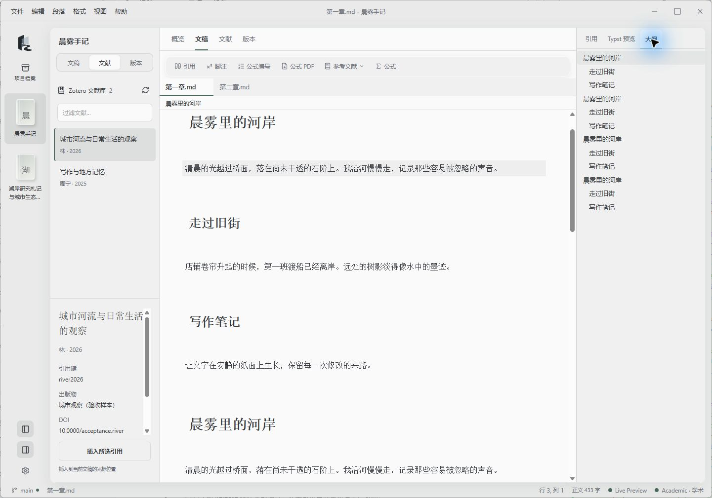
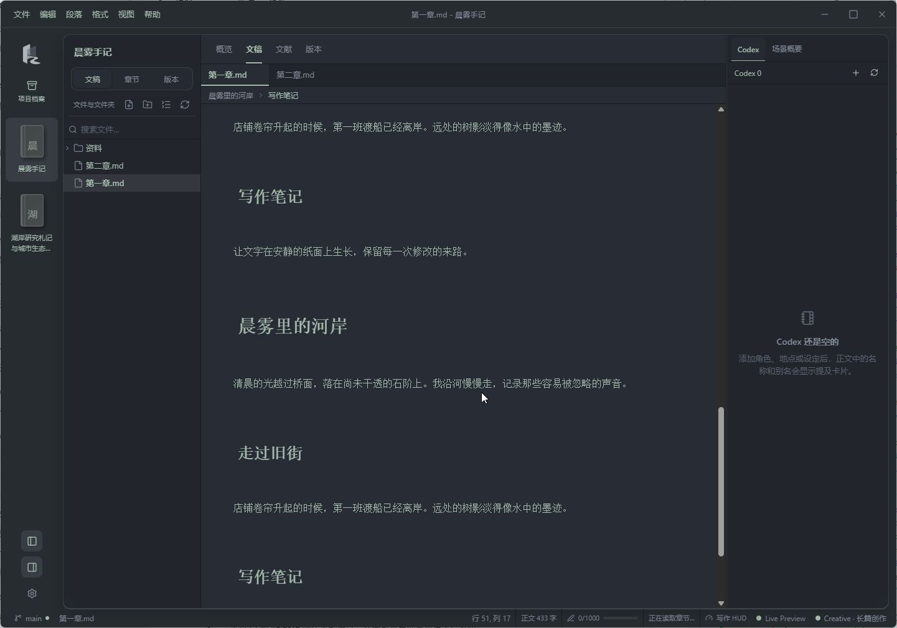

<p align="center">
  
</p>

<h1 align="center">InkStream · 墨流</h1>

<p align="center"><b>把文稿、资料和修改记录，放在同一张写作桌上。</b></p>
<p align="center">面向日常记录、学术写作与长篇创作的桌面应用。文件保存在本机，写作工具随需要展开。</p>

<p align="center">
  <a href="https://github.com/KRPCT/InkStream/releases/latest"></a>
  <a href=".github/workflows/ci.yml"></a>
</p>

<p align="center">
  <a href="https://github.com/KRPCT/InkStream/releases/latest"><b>下载 InkStream</b></a> ·
  <a href="docs/index.md">使用指南</a> ·
  <a href="docs/releases/2.1.0.md">2.1.0 更新日志</a> ·
  <a href="https://github.com/KRPCT/InkStream/issues">反馈问题</a>
</p>



*Windows 实际窗口，使用示例文稿与文献。纸白、石墨灰和低饱和灰绿构成日常写作界面。*

## 下载与开始写作

前往 [2.1.0 发行页](https://github.com/KRPCT/InkStream/releases/tag/v2.1.0)，选择与你的系统对应的安装包。

| 系统 | 安装包 |
| --- | --- |
| Windows x64 | `InkStream_*_x64-setup.exe` |
| macOS · Apple Silicon | `InkStream_*_aarch64.dmg` |
| Linux x64 | `InkStream_*_amd64.deb` 或 `InkStream_*_amd64.AppImage` |

应用内可检查更新、下载安装并重启升级。安装包尚未做 Windows Authenticode 签名与 macOS 公证，首次运行可能出现开发者提示；自动更新载荷有独立的签名校验。详见[更新说明](docs/update.md)。

1. 打开应用，点击左侧「项目档案」，或按 `Ctrl+Alt+P`，选择已有内容文件夹。
2. 打开或新建文稿，直接写作；也可以从独立草稿开始，稍后另存为文件。
3. 按需要展开文献、大纲或版本记录。切换项目时，应用会先保存当前编辑，再恢复目标项目的文稿和布局。

正文仍在你选择的文件夹里。项目名称、封面、会话和搜索索引保存在本机应用数据目录。保存或切换失败会保留原文稿并显示原因。恢复方式与边界见[项目与恢复](docs/projects.md)。

## 2.1.0 的工作台

概览、文稿、文献、版本共用一个工作区。查看资料或修改记录后回到正文，光标、选区和撤销记录仍在。

| 入口 | 用途 |
| --- | --- |
| 概览 | 查看项目中的文件、已打开文稿与待保存内容 |
| 文稿 | 连续写作，按需展开文件树、大纲和上下文工具 |
| 文献 | 筛选文献、查看详情，再点击「插入所选引用」；插入可单独撤销 |
| 版本 | 查看真实提交记录，进入完整版本管理进行分支与差异操作 |

左侧项目轨提供收藏与最近项目的快捷入口。左右面板可独立折叠、调整宽度；工作区、文稿和工具标签支持方向键及 `Home` / `End`。本版还修复了模式菜单裁剪、退出简易模式后创作工具空白等问题。[查看完整更新](docs/releases/2.1.0.md)。

<details>
<summary>查看暗色工作台</summary>



</details>

## 三种写作方式

模式调整布局和工具，不限制文稿格式。可以随时切换；简易模式则进一步收起高级功能，保留写作、项目和草稿恢复。

| 模式 | 常用工具 | 使用指南 |
| --- | --- | --- |
| 通用 · Standard | 文件树、实时预览、大纲、双向链接与知识图谱 | [编辑器](docs/editor.md) · [链接与知识网络](docs/links.md) |
| 学术 · Academic | Zotero 文献、引用与参考文献、公式编号、Typst 预览 | [学术写作](docs/academic.md) · [数学排版](docs/math.md) |
| 创作 · Creative | 章节与场景、角色设定卡、场景概要、字数目标 | [长篇创作](docs/creative.md) |

更多内置工具：

- **写作与专注**：源码和实时预览切换，打字机模式、段落专注与写作计时。「视图」菜单会显示打字机和专注模式的启用状态。[写作辅助](docs/writing.md)
- **修改记录**：本地 Git 提交、分支、远端同步、句级差异与三向合并；GitHub Issue、PR 和审阅集中在版本工具中。[版本管理](docs/git.md) · [GitHub](docs/github.md)
- **阅读与交付**：阅读 Markdown、TXT、DOCX、EPUB、PDF，保存书签与阅读进度；导出 HTML、PDF、DOCX，安装 pandoc 后可使用更多格式。[阅读](docs/reading.md) · [导出](docs/export.md)

Zotero 本机引用功能需要 Zotero 与 Better BibTeX；远端 Git 操作需要相应的 Git 环境和凭据。各项配置与快捷键见[完整使用指南](docs/index.md)。

## 从源码运行

项目使用 Tauri 2、Rust、React、TypeScript 和 CodeMirror 6。准备 Node.js 24、pnpm 11.5.2、Rust stable，以及本平台的 Tauri 构建依赖。具体平台依赖可对照 [CI 配置](.github/workflows/ci.yml)。

```bash
git clone https://github.com/KRPCT/InkStream.git
cd InkStream
corepack enable
corepack prepare pnpm@11.5.2 --activate
pnpm install --frozen-lockfile
pnpm tauri dev
```

运行 `pnpm tauri build --no-bundle` 编译本平台桌面程序，产物位于 `src-tauri/target/release/`。正式安装包及签名更新载荷由 [Release 工作流](.github/workflows/release.yml)生成；本机完整打包需要配置更新签名，或在本地构建配置中关闭 `bundle.createUpdaterArtifacts`。

常用检查：

```bash
pnpm typecheck
pnpm lint
pnpm test:ci
pnpm build
node scripts/acceptance/run-rust.mjs
```

`test:ci` 串行运行功能与大文档性能测试；原生入口覆盖 Rust 的全部生产目标。`pnpm test:acceptance` 运行显式映射的行为检查，不解释 Gherkin。覆盖范围见 [BDD 自动化绑定](docs/specs/AUTOMATION.md)。

代码入口与领域边界见[架构说明](docs/ARCHITECTURE.md)、[领域词汇](CONTEXT.md)和[设计决定](docs/DECISIONS.md)。提交问题时请附上版本、系统、复现步骤；涉及文稿时优先提供不含个人资料的最小样本。

## 项目状态

2.1.0 完成多栏工作台、文献详情与明确插入流程，并同步软件内更新日志。本轮实现已通过三平台 CI、1910 项前端断言、41 项显式行为绑定和三轮 Windows ComputerUse；实际截图与验收范围见[工作台验收记录](docs/WORKBENCH-ACCEPTANCE.md)。

真实外部账号、物理输入法、安装图标和完整跨平台体验仍有专项验收。系统代码签名、macOS Intel 构建与超大知识图谱的 WebGL 渲染尚未提供。最新进展见[当前状态](docs/CURRENT-STATE.md)与 [Issues](https://github.com/KRPCT/InkStream/issues)。

## 支持与许可

InkStream 由个人开发与维护，无订阅、无广告。欢迎反馈问题、参与改进，或通过赞助支持开发；赞助不影响功能访问。

[前往赞助页支持开发](https://azz.ee/catinbox)

源码按 [PolyForm Noncommercial License 1.0.0](LICENSE) 提供，使用、修改与再分发须遵守许可证的非商业用途条件。商业授权请联系作者。
