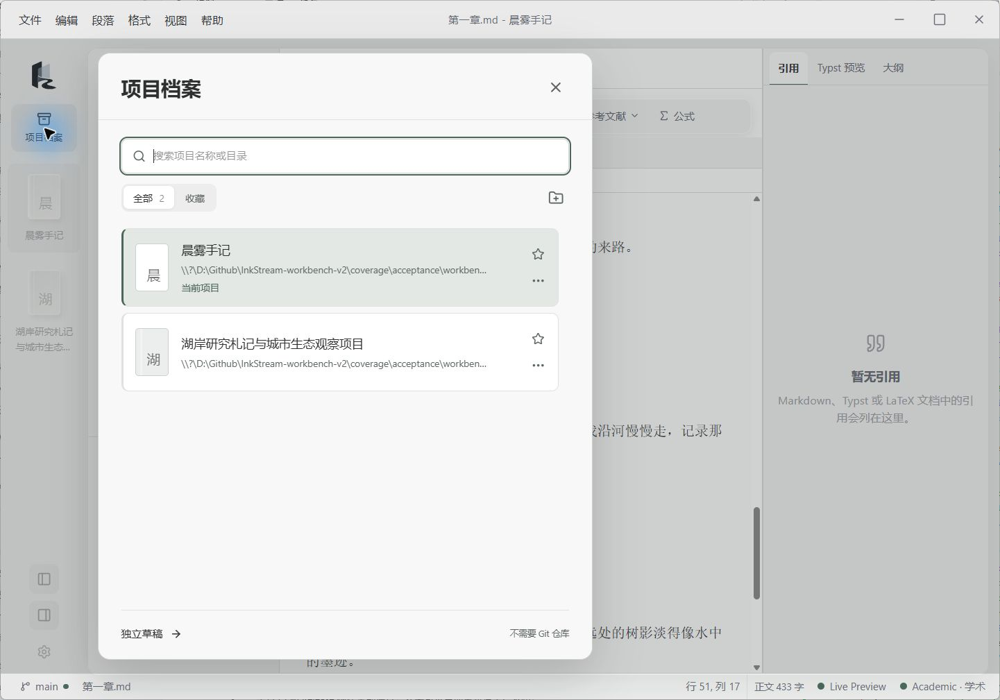

# 多栏工作台验收记录

2026-09-13，实施分支 `codex/workbench-ux-v2`，发布基线 `v2.0.0 / ca4c214`。本轮记录对应[地图 45](https://github.com/KRPCT/InkStream/issues/45)、[实现 47](https://github.com/KRPCT/InkStream/issues/47)、[ComputerUse 48](https://github.com/KRPCT/InkStream/issues/48)。该开发阶段验收已完成；其实现纳入 2.1.0，用户随后授权合并与发布，见 [PR 49](https://github.com/KRPCT/InkStream/pull/49)及[发行页](https://github.com/KRPCT/InkStream/releases/tag/v2.1.0)。以下截图与行为证据对应开发提交 `09b32ff`，不将版本说明更新当作新的行为验收。

## 方法和边界

先写 [WB-01 至 WB-08](specs/workbench-ux.feature) 行为规格，再用真实 React、CodeMirror、项目会话与受控 IPC 边界验证。首个失败测试证明旧列表点击会立即插入；原生验收发现问题后继续补回归、修复和复验。

ComputerUse 使用 Windows 的 `@oai/sky`，实际操作普通 Tauri 构建的窗口、系统目录选择器、菜单、键盘和分隔线。此层没有 DOM 查询、页面脚本、store 注入或应用内自动化桥。独立应用标识为 `com.krpct.inkstream.workbenchcheck20260913`，不使用用户正式配置。

两个项目和文稿为本次创建的真实目录，Git 时间线读取测试仓库实际提交。文献经原生 HTTP/IPC 读取本机受控 BBT 响应，用于核对界面到插入的完整通路；不是 Zotero 真实账号验收。中文通过 ComputerUse 文本输入接口输入，不声称物理拼音输入法已验收。没有执行真实远端评论、推送或账号授权。

## 逐项观察

| 场景 | 实际观察 | 自动与原生证据边界 |
| --- | --- | --- |
| WB-01 概览与正文 | 项目文件数 3、已开文稿数随会话变化；概览往返保留正文选区和滚动，返回正文后可撤销；重启保留已保存内容与标签 | 实例身份由集成测试验证；原生观察见 03–07、26 |
| WB-02 项目切换 | 项目轨显示两个项目，长名称省略但完整名称可读；切回恢复两份标签和写入内容 | 38–39；保存失败由项目会话测试验证 |
| WB-02 目标不可用 | 暂时移动本次测试目录后，从项目轨打开它会显示错误，原项目仍为当前项目；关闭提示后可继续输入和保存 | 40–41；目录随后恢复，实际文件回读包含两段验收文字 |
| WB-03 文献 | 选择条目显示作者、年份、引用键、DOI 和摘要，正文计数不变；明确插入返回原文稿，引用落到原光标；一次撤销只移除该引用 | 08–11、29–30、48–49；最终窄栏插入按钮无需滚动即可使用，所用文献明确标为验收样本 |
| WB-04 库身份 | 旧列表与详情的迟到响应不能覆盖新库或形成插入目标 | 自动竞争时序测试；原生已验空库/失败呈现（50–51），错误后旧插入入口消失；不替代账号切换 |
| WB-05 键盘 | Home/方向键改变工作区焦点；文档方向键实际切换文稿；工具方向键实际显示反链内容 | 13、15–16；关闭的保存/冲突规则由相应集成测试覆盖 |
| WB-06 简易模式 | 在版本页启用简易模式后回到原文稿，文献/版本入口隐藏，正文保留 | 33–34；关闭简易模式后 Codex 工具恢复选中并显示内容，最终复验见 44–45 |
| WB-07 栏宽与缩放 | 文件栏拖宽后，两侧折叠互不影响；缩放复原保持拖过的宽度；放大后工具转为抽屉，收起即可继续输入 | 17–24、54–58，覆盖 100%、125%、130%、150%；临时几何不写回的来源判定另有自动回归 |
| WB-08 版本 | 实际提交信息与本地仓库一致；日常版本页保留两侧导航 | 12、33；无仓库空态与过期仓库过滤另有自动回归 |
| 三模式与主题 | 通用、学术、创作提供各自工具；暗色及减少动效、减少透明度设置可操作 | 28–36、42、54、56；54 明确显示减少效果开关开启；完整跨平台、GPU/长时与第三方主题矩阵不在这些观察中 |

## 原生验收发现并修复

1. 状态栏滚动容器裁剪模式菜单。菜单改为锚定到按钮的独立弹出层；缩放/滚动/项目阻塞时关闭。150% 放大后的原生复验已显示完整菜单（27）。
2. 简易模式退出后，创作工具仍记着不再可用的大纲，导致空白。右栏先派生当前可用目标，再收敛保存的活动工具；已复现 RED 并加入 WB-06 回归。
3. 长文献详情会把插入按钮推到窄侧栏底部之外。资料独立滚动，明确插入操作留在固定的底部区域。
4. 折叠面板退出键盘与辅助功能访问；设置开关补充名称。暗色采用原生暗色滚动条，并提升应用内 SVG 标记对比度；SVG 母版和桌面资源保持用户确认的版本。

## 最后验证状态

最终检查通过：243 份功能测试文件的 1908 项断言，加两份独立性能文件，共 1910 项，零失败、零跳过。41 项显式 BDD 绑定全部通过；Gherkin 未被解释执行，旧专项场景仍按各自证据保留 partial/pending。

最终 TypeScript、ESLint、Vite 与 Tauri 原生构建均通过。三轮 ComputerUse 已完成，最后一轮复验确认工具回退、常驻插入操作、暗色滚动条/标记、文献错误/空态和 125% 浮层。新母版未替换：仓库 SVG SHA-256 仍为 `58ffe1787e8802565d9ac5e5112e270a488954e00b1ecbc37ce11385a4d2510a`。

三轮应用进程 PID 分别为 50188、60288、61500，均经应用退出并完成所属 Job 清理；本次 WebView 子进程和本地 23119 监听均已回收。回读测试文件确认两段验收文字只写入原项目，另一项目不含它们，撤销后的引用也未留在文件中。

本地完整记录位于实施工作树的 `coverage/acceptance/workbench-v2/`：有界命令、进程盘点、三轮原生进程退出记录，以及 `cua/<序号>-<观察>.json/.jpg`。只将少量代表截图收入产品文档，原始日志、测试配置、测试项目和原生包留在忽略目录。

## 仍独立保留的验收

[41](https://github.com/KRPCT/InkStream/issues/41) 的严格同内容并排对照、密集项目矩阵，[42](https://github.com/KRPCT/InkStream/issues/42) 的安装图标/系统缓存，[43](https://github.com/KRPCT/InkStream/issues/43) 的完整弹窗矩阵，以及真实账户、跨平台和物理 IME 验收不能由本轮有限的 Windows 操作代替。相关票按已补证和剩余项继续管理。

## 最终构建截图

文稿、文献详情与大纲同时可见；插入操作保持在窄侧栏底部。

暗色主题及可识别的 SVG 标记：

125% 缩放、减少效果开启时的项目浮层，保留长项目名称：

另见[暗色文献详情与常驻插入操作](assets/workbench/reference-action.jpg)。图片均来自真实窗口，文献内容是明确标示的验收样本。
